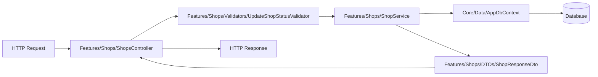

# WebApplication1 Folder Structure Analysis & Recommendations

This document provides a comprehensive structural audit of the `WebApplication1` API codebase. It details the limitations of the current layered structure and presents **two feature-centric, developer-friendly architectural patterns** (Vertical Slice and Actor-Based Slices) designed to eliminate context-switching, accelerate onboarding, and ensure modular scalability.

---

## 1. Executive Summary & Current State Audit

Currently, `WebApplication1` follows a traditional **Horizontal (Layered) Architecture**, where files are grouped by their technical type (what they *are* technically) rather than their business capability (what *domain feature* they implement).

### 🔍 Current Top-Level Structure
```
WebApplication1/
├── Constants/
├── Controllers/         # 32 controllers (Admin, Keeper, User, Public)
├── Data/                # DbContext, Repositories, Migrations
├── DTOs/                # DTO subfolders (Admin, Shops, Keepers, Users, etc.)
├── Filters/             # Action filters
├── Helpers/             # General utility classes
├── Mappings/            # AutoMapper profiles
├── Middleware/          # Logging, Exceptions, Auditing
├── Migrations/          # EF Core Migrations
├── Models/              # Core EF Core Entities
├── Services/            # 21 service implementations
└── Validators/          # FluentValidation validators
```

### ⚠️ Pain Points of the Current Structure
1. **Low Cohesion, High Coupling (The "Shotgun Surgery" Pattern)**
   * *The Problem*: When a developer is asked to add a new field to a **Shop**, they must touch files in at least 5 different top-level folders:
     * `Controllers/ShopsController.cs`
     * `Services/ShopService.cs`
     * `DTOs/Shops/UpdateShopDto.cs`
     * `Models/Entities/Shop.cs`
     * `Validators/UpdateShopValidator.cs`
     * `Mappings/ShopMappingProfile.cs`
   * *The Impact*: High cognitive load, frequent tab context-switching, and fragmented Git commits.
2. **Poor Discoverability (Low "Screaming Architecture")**
   * Looking at the root directories, the code *screams* "ASP.NET Core Web API" rather than screaming what the business actually does (e.g., "NaviDeals: Deals, Journeys, Keeper management, Shop maps").
3. **Bloated Directories & Naming Collisions**
   * The `Controllers/` directory contains 32 flat files. Finding a specific controller requires scrolling through an alphabetical list of unrelated features. 
   * As features grow, files naturally get larger, and namespaces become cluttered.

---

## 2. Option A: Pure Vertical Slice Architecture (Highly Recommended)

**Vertical Slice Architecture (VSA)** focuses on grouping code by **business capability (Features)** instead of technical layers. When you work on a feature, you work inside a single, self-contained feature folder.

### 📂 Proposed Folder Tree
```
WebApplication1/
├── Features/
│   ├── Auth/
│   │   ├── AuthController.cs
│   │   ├── AuthService.cs
│   │   ├── DTOs/
│   │   │   ├── LoginDto.cs
│   │   │   └── RegisterDto.cs
│   │   └── Validators/
│   │       └── LoginValidator.cs
│   ├── Shops/
│   │   ├── ShopsController.cs
│   │   ├── ShopService.cs
│   │   ├── DTOs/
│   │   │   ├── ShopResponseDto.cs
│   │   │   └── UpdateShopStatusDto.cs
│   │   ├── Mappings/
│   │   │   └── ShopMappingProfile.cs
│   │   └── Validators/
│   │       └── UpdateShopStatusValidator.cs
│   ├── Keepers/
│   │   ├── KeepersController.cs
│   │   ├── KeeperService.cs
│   │   └── DTOs/
│   ├── Journeys/
│   │   ├── JourneysController.cs
│   │   ├── JourneyService.cs
│   │   └── DTOs/
│   └── Notifications/
│       ├── NotificationsController.cs
│       ├── NotificationService.cs
│       └── DTOs/
├── Core/ (or Shared/)               # Infrastructure and cross-cutting concerns
│   ├── Data/
│   │   ├── AppDbContext.cs
│   │   └── Repositories/
│   ├── Models/                      # Shareable database entities (EF Core)
│   ├── Middleware/                  # Exceptions, Logging, Auditing
│   ├── Filters/                     # Rate limiting, Validation filters
│   ├── Constants/
│   └── Helpers/
```

### 🔄 Request Flow in Vertical Slice


### 🌟 Developer Experience (DX) Benefits
* **High Locality of Reference**: Everything required to understand or modify a feature resides in a single folder. You can open `Features/Shops` and immediately see all the business rules, validation, and contracts for Shops.
* **Easy Onboarding**: A new developer can be assigned to the "Journeys" feature and only needs to look at `Features/Journeys` without worrying about the rest of the application.
* **Deleted with Ease**: If a business feature is retired, deleting the feature is as simple as deleting a single folder. No orphaned DTOs, mappings, or services are left behind.

---

## 3. Option B: Role/Actor-Based Vertical Slice Architecture

Since `WebApplication1` is structurally partitioned by client applications/roles—specifically **Admin**, **Keeper**, **User**, and **Public/General System**—organizing features by **Actor first, then Feature** is a powerful alternative.

### 📂 Proposed Folder Tree
```
WebApplication1/
├── Areas/ (or Modules/)
│   ├── Admin/                       # Features specific to Admin Dashboard
│   │   ├── Auth/
│   │   ├── Shops/
│   │   │   ├── AdminShopsController.cs
│   │   │   ├── AdminShopService.cs
│   │   │   └── DTOs/
│   │   ├── Notifications/
│   │   │   ├── AdminNotificationsController.cs
│   │   │   └── DTOs/
│   │   └── Reviews/
│   ├── Keeper/                      # Features specific to Keeper App
│   │   ├── Profile/
│   │   │   ├── KeeperProfileController.cs
│   │   │   ├── KeeperProfileService.cs
│   │   │   └── DTOs/
│   │   ├── Offers/
│   │   │   ├── KeeperOffersController.cs
│   │   │   └── DTOs/
│   │   └── Dashboard/
│   ├── User/                        # Features specific to Consumer App
│   │   ├── Search/
│   │   ├── Journeys/
│   │   └── Profile/
│   └── Shared/ (or Public/)         # Public or general application domains
│       ├── Auth/
│       ├── Categories/
│       ├── Tags/
│       └── System/
├── Infrastructure/                  # Cross-cutting infrastructure
│   ├── Data/                        # AppDbContext, Migrations
│   ├── Middleware/
│   ├── Constants/
│   └── Helpers/
```

### 🔄 Request Scoping & Security Boundary
```
  [HTTP Request]
        │
        ▼
  [Route Matching]
   ├── /api/v1/admin/*  ──> [Areas/Admin]  ──> Enforces AdminPolicy & Scoped Auth
   ├── /api/v1/keeper/* ──> [Areas/Keeper] ──> Enforces KeeperPolicy & Scoped Auth
   └── /api/v1/user/*   ──> [Areas/User]   ──> Enforces UserPolicy & Scoped Auth
```

### 🌟 Developer Experience (DX) Benefits
* **Strong Security Boundaries**: Controllers inside the `Areas/Admin/` folder can inherit from an `AdminBaseController` that applies security globally, preventing authorization bypass bugs.
* **Separation of Role Responsibilities**: Avoids creating bloated services. For example, `AdminOfferService` handles bulk activations and moderation, while `KeeperOfferService` handles creation and editing. They are clean, distinct, and decoupled.
* **Matches Frontend Repositories**: This API structure perfectly matches the separate frontends running in the workspace (`admin-fronend`, `keeper-frontend`, and `locator_user`).

---

## 4. Architecture Comparison Matrix

| Criteria | Current Layered Architecture | Option A: Vertical Slice | Option B: Actor-Based Slices |
| :--- | :--- | :--- | :--- |
| **Cognitive Load** | 🔴 **High** (Scatter across 6+ folders) | 🟢 **Very Low** (Single directory) | 🟢 **Very Low** (Single domain-actor dir) |
| **Screaming Design** | 🔴 **No** (Technical folders only) | 🟢 **Yes** (Business domains visual) | 🟢 **Yes** (Actors and domains visual) |
| **Security Setup** | 🟡 **Manual** (Attribute decoration per file) | 🟡 **Manual** (Requires individual attention) | 🟢 **Automatic** (Folder-based base controllers) |
| **Scaling Capability** | 🔴 **Poor** (Folders become dump-sites) | 🟢 **Excellent** (Folders stay small) | 🟢 **Excellent** (Highly structured) |
| **Refactoring Risk** | 🔴 **High** (High chance of side effects) | 🟢 **Low** (Isolated to slice) | 🟢 **Low** (Isolated to actor module) |
| **Migration Effort** | 🟢 **None** | 🟡 **Medium** (Standard relocation) | 🟡 **Medium** (Standard relocation) |

---

## 5. Step-by-Step Migration Strategy

To transition safely without halting active development, follow this incremental migration guide:

### Phase 1: Preparation (Zero Code Movement)
1. Introduce assembly scanning for Dependency Injection and AutoMapper. This ensures that when files move, their DI configurations do not break.
2. Ensure you have automated Swagger specifications saved (which are already in `swagger_success.json`) to verify endpoint routing remains 100% identical post-migration.

### Phase 2: Core/Infrastructure Extraction
1. Create the `Core/` or `Infrastructure/` folder.
2. Move `Data/`, `Middleware/`, `Filters/`, `Helpers/`, and `Constants/` to this folder.
3. Update namespaces. A global IDE regex replace for `using allonbiz.AdminAPI.Data;` to `using allonbiz.AdminAPI.Core.Data;` handles this instantly.

### Phase 3: Incremental Feature Migration (One by One)
Migrate a single vertical slice to test the pipeline (e.g., `Tags`).
1. Create `Features/Tags/` (Option A) or `Areas/Shared/Tags/` (Option B).
2. Move `Controllers/TagsController.cs`, `Services/TagService.cs`, `DTOs/Tags/` files, and `Validators/TagValidators` to the folder.
3. Update their namespaces.
4. Run the project and execute a Swagger/API sanity check for the Tag endpoints.
5. Once tested, migrate `Shops`, then `Keepers`, and so on.

---

## 6. Implementation Trick: Automated DI & AutoMapper Scanning

In a feature-based architecture, having developers manually register services in `Program.cs` becomes a major bottleneck. We can automate this using **Assembly Reflection** or **Scrutor**.

### 🛠️ Automated Dependency Injection Extension
You can create a service scanner in `Core/Extensions/ServiceCollectionExtensions.cs` so that any class ending with `Service` that implements an interface is automatically registered:

```csharp
using System.Reflection;
using Microsoft.Extensions.DependencyInjection;

namespace allonbiz.AdminAPI.Core.Extensions
{
    public static class DependencyInjectionExtensions
    {
        public static IServiceCollection RegisterFeatureServices(this IServiceCollection services)
        {
            var assembly = Assembly.GetExecutingAssembly();

            // 1. Scan for Services and register under their matching Interface
            var serviceTypes = assembly.GetTypes()
                .Where(t => t.IsClass && !t.IsAbstract && t.Name.EndsWith("Service"))
                .ToList();

            foreach (var serviceType in serviceTypes)
            {
                var interfaceType = serviceType.GetInterface($"I{serviceType.Name}");
                if (interfaceType != null)
                {
                    services.AddScoped(interfaceType, serviceType);
                }
                else
                {
                    // Fallback to self-registration if no direct matching interface is found
                    services.AddScoped(serviceType);
                }
            }

            return services;
        }
    }
}
```

Then in `Program.cs`, replace all the manual `AddScoped` calls with a single line:
```csharp
// Replace 40 lines of manual AddScoped with:
builder.Services.RegisterFeatureServices();
```

### 🛠️ Automated AutoMapper Mapping Setup
Since we already have AutoMapper scanning the assembly:
```csharp
builder.Services.AddAutoMapper(cfg => cfg.AddMaps(typeof(Program).Assembly));
```
Moving profiles into feature folders **requires zero configuration changes**. AutoMapper will find them automatically!

---

## 🎯 Recommendation Summary

For the `WebApplication1` workspace:
* **Go with Option B (Actor-Based Vertical Slice Architecture)** if your team consists of developers specialized in different frontends. This will structure your workspace beautifully, match the exact frontends (`admin-fronend`, `keeper-frontend`, `locator_user`), and strictly enforce role security boundaries.
* **Go with Option A (Pure Vertical Slice)** if you want a simpler, unified API structure where every domain (e.g. `Offers` or `Reviews`) is kept as a single slice regardless of the actor calling it.

Both options are highly modern, clean, and provide a premium, industry-standard developer experience.
